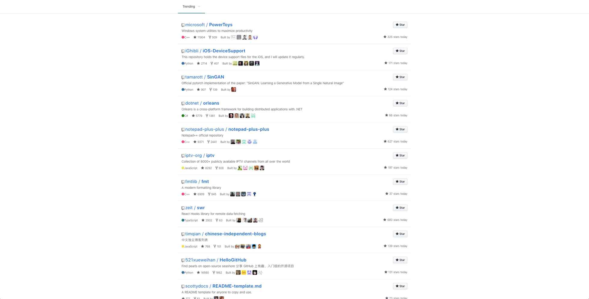

chrome-dashboard (Chrome Extension) V0.0.1
==========
（Last Update Nov 11th, 2019)

[]

[chrome-dashboard.crx](https://github.com/whyour/chrome-dashboard/blob/master/chrome-dashboard.crx)

Install (Chrome)
----
1. open Extensions from chrome.

2. Open Develop Mode first，Drag and drop downloaded 'chrome-dashboard.crx' into chrome, finish!

Changelog
-------
`2019-11-01`
* Add trending list

License
--------
MIT
